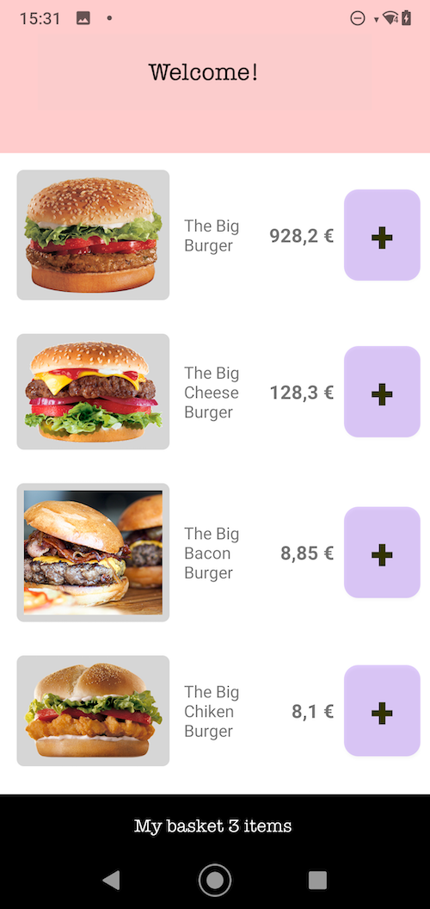
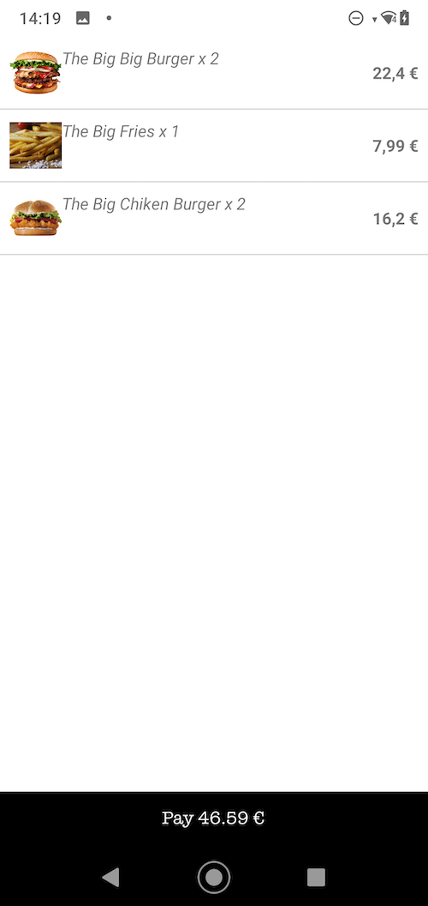

# sutrix-ua-test

## Instructions

 - You have 2 - 4 days to build an Android application.
 - Please build your application using Kotlin (Android).
 - Please use MVVM in your application.
 - It is highly recommended that you spend some time planning your deliverables, implementation methods, and architecture before jumping into the implementation.

## Requirements

 - Identify the issues with current code.
 - Display the burgers' list on welcome screen.
 - Fetch burgers from "https://uad.io/bigburger".
 - Add "Cart" screen.
 - The "+" button from "Catalog" screen now allow adding burger to cart.
 - Bottom screen button display current basket content items count and allow to open "Cart" screen, which list cart's items.
 - The user find his cart back when he kills the app and re-launch it.

